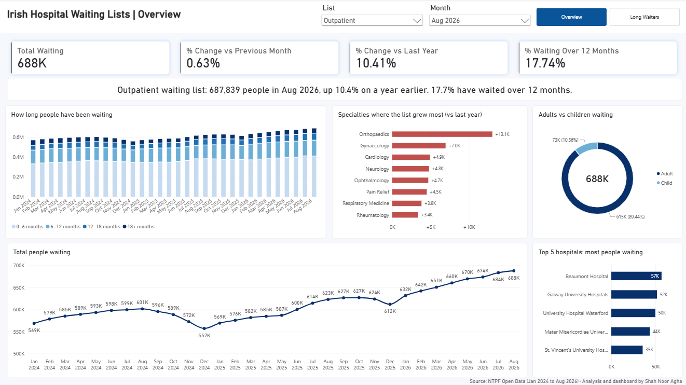
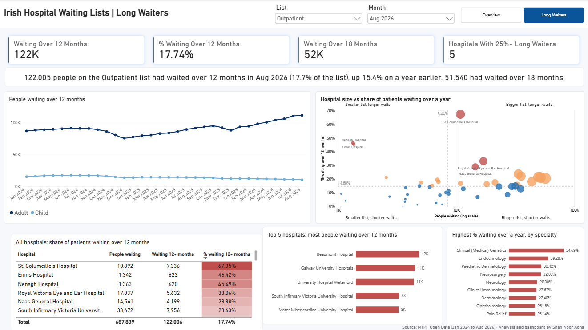
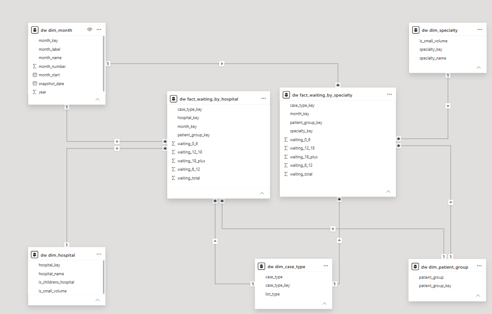

# Irish Hospital Waiting Lists

A SQL Server and Power BI project looking at public hospital waiting lists in Ireland, using the National Treatment Purchase Fund (NTPF) open data from January 2024 to August 2026.



## What I wanted to find out

1. How has the waiting list changed month by month?
2. Which specialties and hospitals have the most people waiting?
3. Who is waiting longest, and is it getting better or worse?
4. Do adults and children have the same experience?

## Key findings (outpatient list, August 2026)

* **687,839 people** were waiting for a first outpatient appointment, up **10.4%** on a year earlier and **23.5%** higher than the low point of 557,186 in December 2024.
* **122,005 people (17.7%)** had been waiting more than a year, and **51,540** more than 18 months.
* The number of people waiting over a year grew **15.4%** in twelve months, faster than the list itself.
* **Orthopaedics** grew the most, with **13,063** more people waiting than a year earlier.
* **Five hospitals** account for about **a third (34.6%)** of the whole outpatient list.
* Adults waiting over a year went from 87,150 to 111,686 (**up 28%**) since January 2024, while children waiting over a year went from 15,209 to 10,319 (**down 32%**).
* **Five hospitals** have a quarter or more of their patients waiting over a year. The biggest lists are not always the ones with the longest waits, which is why the dashboard compares hospitals by percentage as well as by size.

These describe what the data shows. The data does not say why the numbers changed, so I have not tried to explain causes.



## How it was built

```
NTPF CSV files  ->  SQL Server staging  ->  cleaning views  ->  star schema  ->  Power BI
     (12)             (raw text)          (dates, numbers)     (dw schema)     (2 pages)
```

**Tools:** SQL Server, T-SQL, Power BI Desktop, DAX

### Data model

Two fact tables and five dimensions:

* `fact_waiting_by_specialty`: national figures by month, list, adult/child and specialty
* `fact_waiting_by_hospital`: figures by month, hospital, case type (inpatient, day case, outpatient) and adult/child
* `dim_month`, `dim_specialty`, `dim_hospital`, `dim_case_type`, `dim_patient_group`

NTPF publishes specialty figures and hospital figures in separate files, and neither has both together. So the model keeps them as two facts that share the month, list and patient group dimensions.



### Measures worth mentioning

* **Waiting lists are a snapshot, not a total.** The count for March includes most of the same people as February. So the measures add up across hospitals and specialties but never across months. If several months are selected, they show the latest one.
* **Previous month and same month last year** use `EDATE` on the first day of each month, because NTPF takes its count on a different day every month.
* **The "% waiting over 12 months" measures** divide by the sum of the time bands rather than the Total column, so the percentages stay consistent with the bands they are built from.
* **The headline sentences** on each page are DAX measures, so they rewrite themselves when the list or month changes.

## Data quality

Most of the time on this project went here, and it is the part I am happiest with.

| Issue | What I found | What I did |
|---|---|---|
| Numbers stored as text | Values like `"14,579"` with commas, in quotes | Removed commas and line break characters, then converted to integers |
| Blank lines | Some files end with an empty line, which breaks SQL Server's CSV import | The loader counts the real rows first and stops before the blank ones |
| Dates | Day/month/year, on a different day each month | Converted properly and gave each row a month key (e.g. 202608) |
| Duplicate specialties | In Oct 2025, Nov 2025 and Jan 2026 the outpatient file lists most specialties twice, with different numbers | Keeping only one row would drop about 240,000 people and break the trend, so the rows are parts of the same list. They are added together |
| Rounding | NTPF rounds small numbers for privacy, so time bands do not always add up to the total (off by 1 or 2) | Totals use the Total column, time breakdowns use the bands |
| Small volumes | Hospitals or specialties with fewer than 20 people are grouped as "Small Volume" | Flagged in the dimensions and left out of rankings |

### Reconciliation with NTPF's published figures

| Month | List | NTPF published | This project | Difference |
|---|---|---|---|---|
| Dec 2025 | Inpatient/Day Case | 107,181 | 107,181 | 0 |
| Dec 2025 | Outpatient | 611,987 | 611,989 | 2 |
| May 2026 | Inpatient/Day Case | 115,450 | 115,452 | 2 |
| May 2026 | Outpatient | 669,506 | 669,505 | -1 |

The small differences come from NTPF's rounding. Every number on the dashboard was also recalculated in plain SQL, separately from Power BI, and matched the DAX results.

## Code and files

This repository shows the approach, the findings and the dashboard. The code itself is not included.

The following are available on request, just message me on [LinkedIn](https://www.linkedin.com/in/shah-noor-agha-936262194/):

* 5 SQL scripts: database setup and CSV loader, loading the 12 NTPF files, cleaning and star schema, 7 data quality checks, and a script that recalculates every dashboard figure in SQL
* The Power BI file with both report pages and all DAX measures

The data itself is public and can be downloaded from the [NTPF Open Data page](https://www.ntpf.ie/waiting-list-data/open-data/).

## Limitations

* The data is a monthly count of people waiting. It does not include how many people were seen or removed from the list.
* Hospital and specialty figures cannot be combined, because NTPF publishes them separately.
* NTPF's privacy rounding means some small numbers are approximate.

## Data source

National Treatment Purchase Fund (NTPF) Open Data, © NTPF: [ntpf.ie/waiting-list-data/open-data](https://www.ntpf.ie/waiting-list-data/open-data/). Reused under the Re-use of Public Sector Information Regulations.

This is a personal portfolio project and my own analysis. It is not affiliated with or endorsed by the NTPF or the HSE.

## About me

Shah Noor Agha, Power BI developer and data analyst based in Dublin.
[LinkedIn](https://www.linkedin.com/in/shah-noor-agha-936262194/)

---

© 2026 Shah Noor Agha. All rights reserved. This project is shared for viewing as part of my portfolio. Please don't copy or reuse it without permission.
